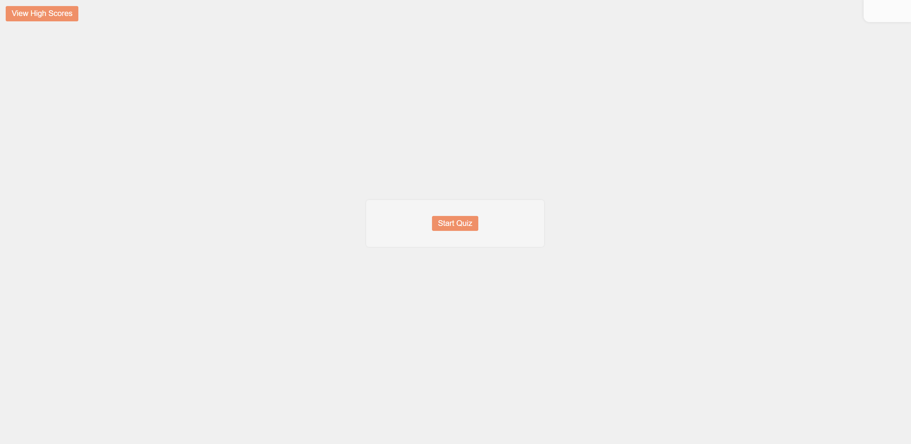

# Code Quiz

## Description

This web-based quiz application is designed to test your knowledge of JavaScript fundamentals. It features an interactive and dynamic user interface built using HTML, CSS, and JavaScript. The quiz presents a series of carefully crafted questions related to coding concepts and evaluates your performance based on the speed and accuracy of your responses.

## Table of Contents

1. [Features](#features)
2. [Installation](#installation)
3. [Usage](#usage)
4. [Contribution](#contribution)
5. [License](#license)
6. [Questions](#questions)

## Features

* A fully responsive design ensures an optimal viewing experience on various devices, including desktops, tablets, and smartphones.
* The quiz includes a countdown timer that adds an element of urgency and challenges users to answer questions within the allotted time.
* Incorrect answers are penalized by deducting time from the remaining countdown, emphasizing the importance of accuracy.
* The application includes a high score system that allows users to save their scores and initials to local storage, enabling them to track their progress over time.

## Installation

To install the Code Quiz application, please follow these steps:

1. Clone the repository to your local machine using the following command: git@github.com:2015johngtz/m4-chall-qna.git
2. Open the `index.html` file in your preferred web browser.
3. Alternatively, you can access the deployed application by navigating to: https://github.com/2015johngtz/m4-chall-qna

## Usage

Follow these steps to use the Code Quiz application effectively:

1. Click the 'Start Quiz' button to initiate the quiz.
2. Read each question carefully and select the most appropriate answer within the given time limit.
3. For each correct answer, you will earn points and proceed to the next question.
4. If you select an incorrect answer, time will be deducted from the remaining countdown.
5. At the end of the quiz, enter your initials to save your score and compare it with other participants.

## Contribution

At the moment, this project is not open for contributions. However, you are encouraged to fork the repository and make any modifications or enhancements for personal use.

## License

This project is licensed under the terms of the MIT License. For more details, please refer to the [LICENSE](LICENSE) file.

## Questions

If you have any additional questions or comments, please feel free to reach out to me:

* GitHub: https://github.com/2015johngtz
